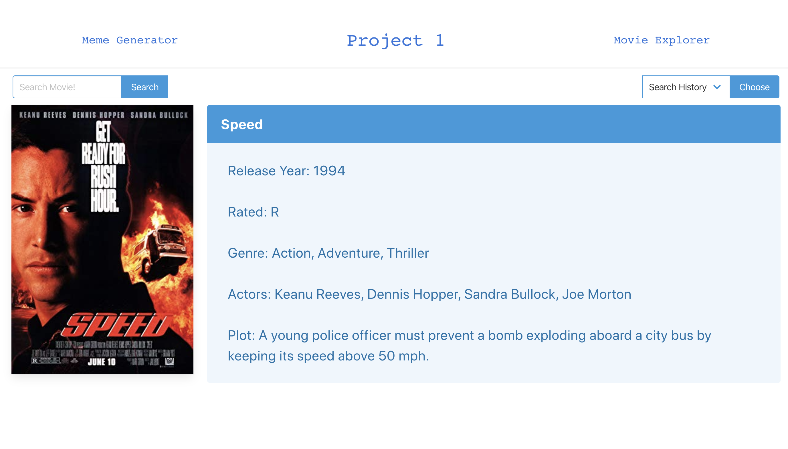

# 04-Web-APIs-Quiz

## Overview

The purpose of this application is to allow users to search their favorite movies or find info on movies they want to see along with having the ability create their own memes with a secondary application.

### Gallery

Meme Generator:

Movie Explorer:

### Problem

Currently ... trying to improve the Meme Generator so that it can include more options, mainly increase the amount of text boxes based on the meme they choose from. (Currently only allowing 2 text boxes but want to allow more than that)

As for the Movie Explorer, we are currently limited to only searching the name. Implementing different filters is a future plan.

### Solution

Our solution will to implement them later on to make sure we understand their concept and intergration with an application

## Tech and Features Used

* HTML
* CSS
* Bulma
* Javascript
* Library API

## How to use

Simply choose which application you would like to use, the Meme Generator or Movie Explorer. 

### Meme Explorer

1. Choose an image as the main idea of the meme
2. Add the text that you want in the two field provided
3. Click 'Submit'
4. Right click on the picture on the left and save your meme!
5. Share your meme with your friends

### Movie Explorer

1. Type the name of the movie you want to know about in the search bar and click 'search'
2. Enjoy all the information of the movie you searched for

## Authors

* **Braydon Nelson** 
* **Ryan Thomas**

Link to example readme:

https://braydon-nelson.github.io/project-1/
